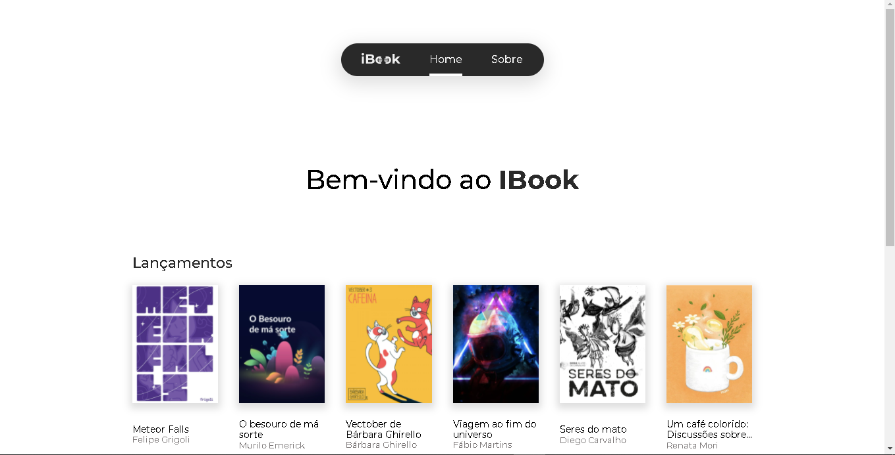
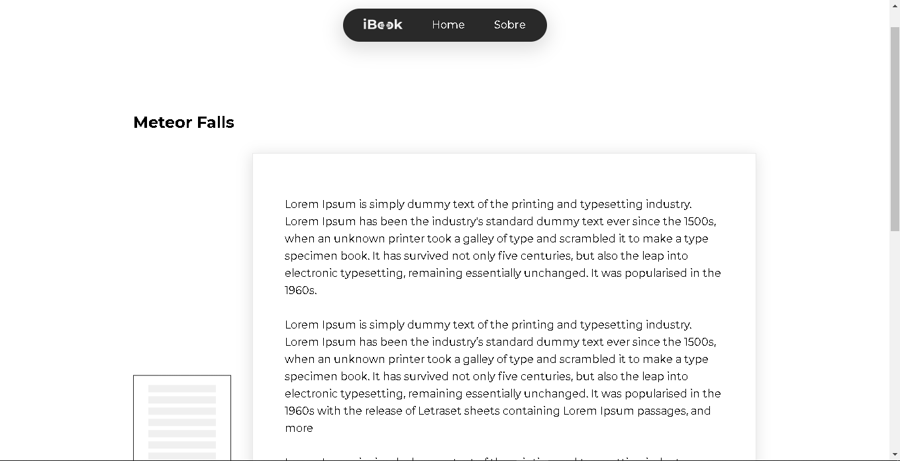
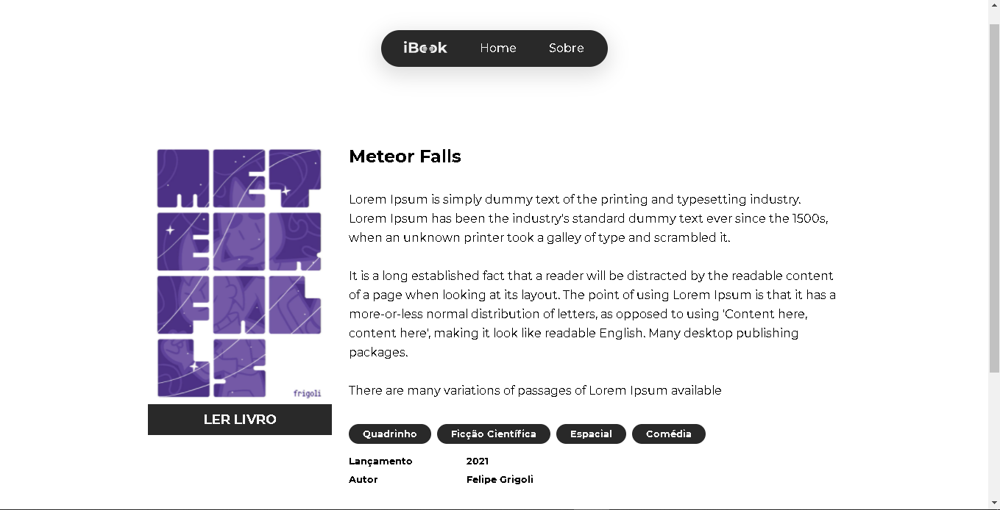
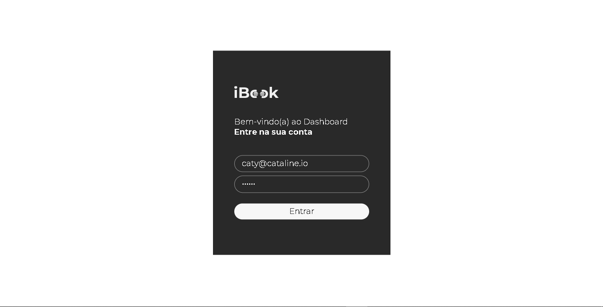

# Ibook
Projeto feito do no curso da [cataline](https://cataline.io)
@cataline4learning

## Tecnologias usadas

- VueJs
- NuxtJs
- Vuex
- Typescript

## Caminhos

### `/`

### `/book/[ID]/reader`

### `/book/[ID]`

### `/login`
